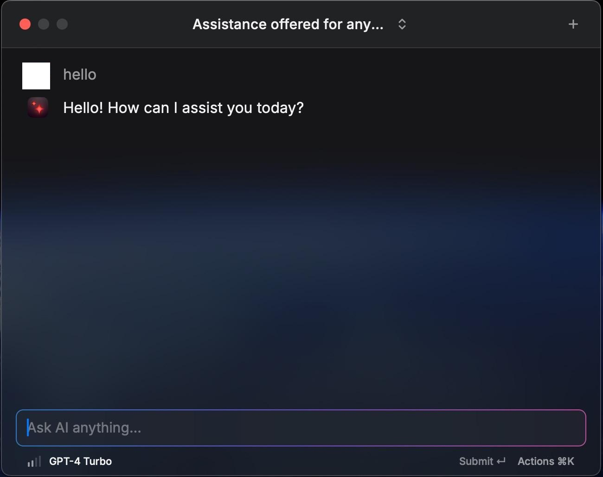

# Raycast AI Proxy

This is a simple [Raycast AI](https://raycast.com/) API proxy. It allows you to use the [Raycast AI](https://raycast.com/ai) app without a subscription.
It's a simple proxy that forwards requests from Raycast to the OpenAI API, converts the format, and returns the response in real-time.

[English](README.md) | [中文](README.zh.md) | [日本語](README.ja.md)

## Introduction

### Supported Models
>
> Multiple models can be used simultaneously by setting the corresponding environment variables

| Provider | Model Name | Test Status | Environment Variables |
| --- | --- | --- | --- |
| `openai` | gpt-3.5-turbo,gpt-4-turbo,gpt-4o | Tested | `OPENAI_API_KEY` |
| `azure openai` | - | Tested | `AZURE_OPENAI_API_KEY`, `AZURE_DEPLOYMENT_ID`, `OPENAI_AZURE_ENDPOINT` |
| `google` | gemini-pro,gemini-1.5-pro | Tested | `GOOGLE_API_KEY` |

### Ai chat



### Translate


## How to Use

### Quick Start with Docker

1. Generate certificates

```sh
pip3 install mitmproxy
python -c "$(curl -fsSL https://raw.githubusercontent.com/yufeikang/raycast_api_proxy/main/scripts/cert_gen.py)"  --domain backend.raycast.com  --out ./cert
```

2. Start the service

```sh
docker run --name raycast \
    -e OPENAI_API_KEY=$OPENAI_API_KEY \
    -p 443:443 \
    --dns 1.1.1.1 \
    -v $PWD/cert/:/data/cert \
    -e CERT_FILE=/data/cert/backend.raycast.com.cert.pem \
    -e CERT_KEY=/data/cert/backend.raycast.com.key.pem \
    -e LOG_LEVEL=INFO \
    -d \
    ghcr.io/yufeikang/raycast_api_proxy:main
```

3. Change the OPENAI environment variable to using the Azure OpenAI API

See [How to switch between OpenAI and Azure OpenAI endpoints with Python](https://learn.microsoft.com/en-us/azure/ai-services/openai/how-to/switching-endpoints)

```sh
docker run --name raycast \
    -e OPENAI_API_KEY=$OPENAI_API_KEY \
    -e OPENAI_API_BASE=https://your-resource.openai.azure.com \
    -e OPENAI_API_VERSION=2023-05-15 \
    -e OPENAI_API_TYPE=azure \
    -e AZURE_DEPLOYMENT_ID=your-deployment-id \
    -p 443:443 \
    --dns 1.1.1.1 \
    -v $PWD/cert/:/data/cert \
    -e CERT_FILE=/data/cert/backend.raycast.com.cert.pem \
    -e CERT_KEY=/data/cert/backend.raycast.com.key.pem \
    -e LOG_LEVEL=INFO \
    -d \
    ghcr.io/yufeikang/raycast_api_proxy:main
```

4. Experimental Google Gemini support

> Can be used simultaneously with the OpenAI API, just set the corresponding environment variables

Obtain your [Google API Key](https://makersuite.google.com/app/apikey) and export it as `GOOGLE_API_KEY`.

```sh
# git clone this repo and cd to it
docker build -t raycast .
docker run --name raycast \
    -e GOOGLE_API_KEY=$GOOGLE_API_KEY \
    -p 443:443 \
    --dns 1.1.1.1 \
    -v $PWD/cert/:/data/cert \
    -e CERT_FILE=/data/cert/backend.raycast.com.cert.pem \
    -e CERT_KEY=/data/cert/backend.raycast.com.key.pem \
    -e LOG_LEVEL=INFO \
    -d \
    raycast:latest
```

### Install Locally

1. Clone this repository
2. Use `pdm install` to install dependencies
3. Create an environment variable

```
export OPENAI_API_KEY=<your openai api key>
```

4. Use `./scripts/cert_gen.py --domain backend.raycast.com  --out ./cert` to generate a self-signed certificate
5. Start the service with `python ./app/main.py`

### Configuration

1. Modify `/etc/host` to add the following line:

```
127.0.0.1 backend.raycast.com
::1 backend.raycast.com
```

The purpose of this modification is to point `backend.raycast.com` to the localhost instead of the actual `backend.raycast.com`. You can also add this
record in your DNS server.

2. Add the certificate trust to the system keychain

Open the CA certificate in the `cert` folder and add it to the system keychain and trust it.
This is **necessary** because the Raycast AI Proxy uses a self-signed certificate and it must be trusted to work properly.

Note:

When using macOS on Apple Silicon, if you experience issues with applications hanging when manually adding a CA certificate to
`Keychain Access`, you can use the following command in the terminal as an alternative method:

[mitmproxy document](https://docs.mitmproxy.org/stable/concepts-certificates/#installing-the-mitmproxy-ca-certificate-manually)

```shell
sudo security add-trusted-cert -d -p ssl -p basic -k /Library/Keychains/System.keychain ~/.mitmproxy/mitmproxy-ca-cert.pem
```
