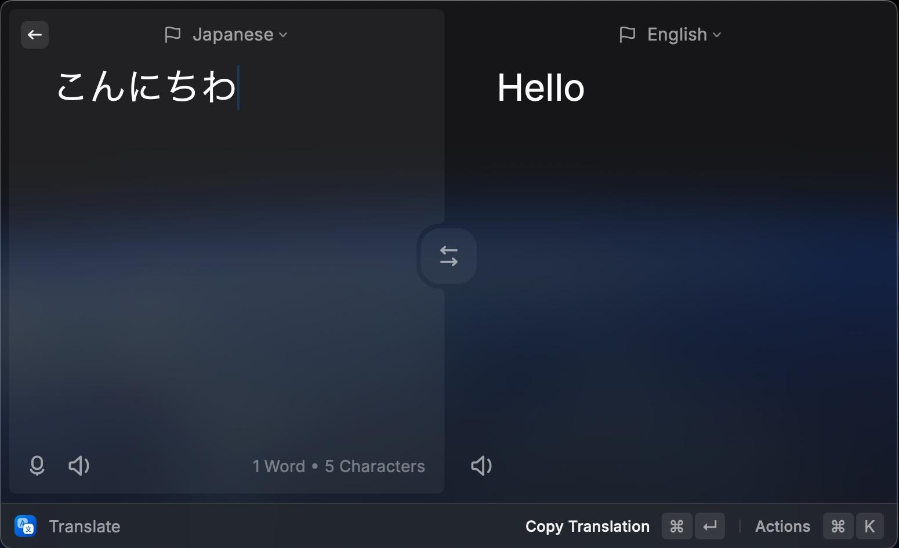

# Raycast AI 代理

这是一个简单的 [Raycast AI](https://raycast.com/)API代理。它允许您在不订阅的情况下使用 [Raycast AI](https://raycast.com/ai)
应用。它是一个简单的代理，将raycast的请求转换格式转发到 OpenAI 的 API，响应后再实时转换格式返回。

[English](README.md) | [中文](README.zh.md)

## 介绍

### 支持的模型
>
> 多个模型可以同时使用，只需设置相应的环境变量即可

| 模型provider | 模型 | 测试状态 | 环境变量 |
| --- | --- | --- | --- |
| `openai` | gpt-3.5-turbo,gpt-4-turbo, gpt-4o | 已测试 | `OPENAI_API_KEY` |
| `azure openai` | 同上 | 已测试 | `AZURE_OPENAI_API_KEY`, `AZURE_DEPLOYMENT_ID`, `OPENAI_AZURE_ENDPOINT` |
| `google` | gemini-pro,gemini-1.5-pro | 已测试 | `GOOGLE_API_KEY` |

### Ai chat


### Translate



## 使用方法

### Docker 快速启动

1. 生成证书

```sh
pip3 install mitmproxy
python -c "$(curl -fsSL https://raw.githubusercontent.com/yufeikang/raycast_api_proxy/main/scripts/cert_gen.py)"  --domain backend.raycast.com  --out ./cert
```

2. 启动服务

```sh
docker run --name raycast \
    -e OPENAI_API_KEY=$OPENAI_API_KEY \
    -p 443:443 \
    --dns 1.1.1.1 \
    -v $PWD/cert/:/data/cert \
    -e CERT_FILE=/data/cert/backend.raycast.com.cert.pem \
    -e CERT_KEY=/data/cert/backend.raycast.com.key.pem \
    -e LOG_LEVEL=INFO \
    -d \
    ghcr.io/yufeikang/raycast_api_proxy:main
```

3. 使用 Azure OpenAI API

See [How to switch between OpenAI and Azure OpenAI endpoints with Python](https://learn.microsoft.com/en-us/azure/ai-services/openai/how-to/switching-endpoints)

```sh
docker run --name raycast \
    -e OPENAI_API_KEY=$OPENAI_API_KEY \
    -e OPENAI_API_BASE=https://your-resource.openai.azure.com \
    -e OPENAI_API_VERSION=2023-05-15 \
    -e OPENAI_API_TYPE=azure \
    -e AZURE_DEPLOYMENT_ID=your-deployment-id \
    -p 443:443 \
    --dns 1.1.1.1 \
    -v $PWD/cert/:/data/cert \
    -e CERT_FILE=/data/cert/backend.raycast.com.cert.pem \
    -e CERT_KEY=/data/cert/backend.raycast.com.key.pem \
    -e LOG_LEVEL=INFO \
    -d \
    ghcr.io/yufeikang/raycast_api_proxy:main
```

4. Google Gemini API

> 可同时和 OpenAI API 一起使用，只需设置相应的环境变量即可

获取你的 [Google API Key](https://makersuite.google.com/app/apikey) 然后 export 为 `GOOGLE_API_KEY`.

```sh
# git clone this repo and cd to it
docker build -t raycast .
docker run --name raycast \
    -e GOOGLE_API_KEY=$GOOGLE_API_KEY \
    -p 443:443 \
    --dns 1.1.1.1 \
    -v $PWD/cert/:/data/cert \
    -e CERT_FILE=/data/cert/backend.raycast.com.cert.pem \
    -e CERT_KEY=/data/cert/backend.raycast.com.key.pem \
    -e LOG_LEVEL=INFO \
    -d \
    raycast:latest
```

### 在本地安装

1. clone 本仓库
2. 使用 `pdm install` 安装依赖项
3. 创建环境变量

```
export OPENAI_API_KEY=<your openai api key>
```

4. 使用 `./scripts/cert_gen.py --domain backend.raycast.com  --out ./cert` 生成自签名证书
5. 用`python ./app/main.py`启动服务

### 配置

1. 修改 `/etc/host` 以添加以下行：

```
127.0.0.1 backend.raycast.com
::1 backend.raycast.com
```

此修改的目的是为了把 `backend.raycast.com` 指定到本地，而不是真正的 `backend.raycast.com`。当然你也可以在你的dns server中添加这个记录。

2. 将证书信任添加到系统钥匙链

打开 `cert` 文件夹中的 ca 证书，并将其添加到系统钥匙链并信任。
这是**必须**的，因为 Raycast AI 代理使用自签名证书，必须信任它才能正常工作。

注意：

在Apple Silicon的macOS上使用时，如果在手动向`钥匙串访问`添加CA证书时遇到应用程序挂起的问题，您可以在终端使用以下命令作为替代方法：

[mitmproxy document](https://docs.mitmproxy.org/stable/concepts-certificates/#installing-the-mitmproxy-ca-certificate-manually)

```shell
sudo security add-trusted-cert -d -p ssl -p basic -k /Library/Keychains/System.keychain ~/.mitmproxy/mitmproxy-ca-cert.pem
```

### 注意事项

1. DNS指定
由于GFW的存在，如果你在中国大陆使用，你可能需要指定一个国内的DNS服务器，否则可能会出现无法解析域名的情况。
如： `--dns 223.5.5.5`
